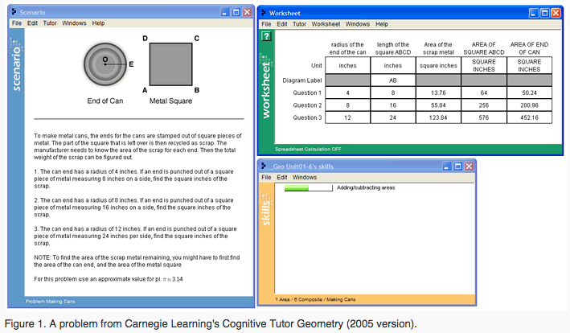
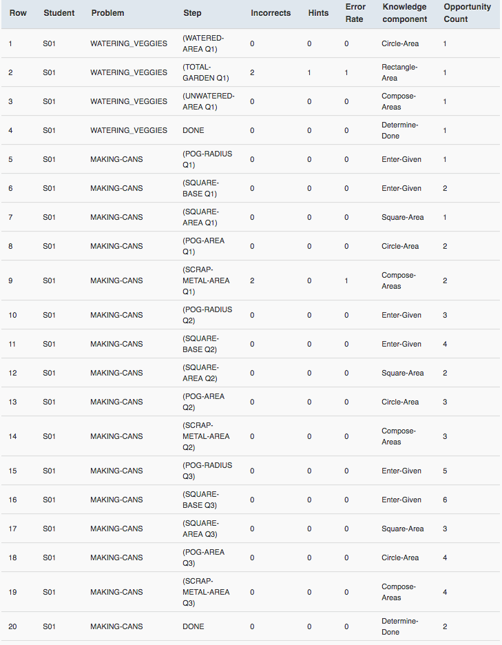
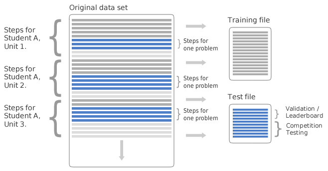

# Data Mining Project 

You need to finish an entire machine learning system on provided dataset.

## Submission

There should be three parts in your submission.

### Report

A two-page report to describle the entire pipeline of your work with necessary illustrations and tables, including but not limited to
* How do you seperate your dataset?
* What do you do for feature engineering?
* Which algorithm do you choose? How does it perform?
* How do you select hyperparameters?
and so on.

Besides talking about what and how, you also need to explain the reasons why you do this. The minimum requirement is that your entire work should be a complete machine learning system.

### Answers of the rest in testset

We'll only offer a subset of correct answers for test data. To submit your results, you should complete the missing values of Correct First Attempt in ***test.csv***, which means replace NaN with the value your model predicts. Then you need to submit your completed ***test.csv***. (Don't submit data.csv.)

**Note: For those who don't obey our submission rules, we'll give it 0 point. If you have any question about this, post it on Piazza.**

### Codes

You also need to upload your codes with an introduction file. We'll do duplicate checking for all the submitted codes, so don't copy other people's codes.

*Bonus*: We'll offer additional points for those using PySpark to implement the algorithms.

## Project Introduction

### Task Description

This project asks you to predict student performance on mathematical problems from logs of student interaction with Intelligent Tutoring Systems. This task presents interesting technical challenges, has practical importance, and is scientifically interesting.

Some student performance labels will be withheld for the test portion. You need to develop a learning model based on training data sets and use this algorithm to learn from the training portion of the challenge data sets, and then accurately predict student performance in the test sections.

### Data Format

Our available data takes the form of records of interactions between students and computer-aided-tutoring systems. The students solve problems in the tutor and each interaction between the student and computer is logged as a transaction. Four key terms form the building blocks of our data. These are problem, step, knowledge component, and opportunity. To more concretely define these terms, we'll use the following scenario:

We also offer an Ipython notebook named ***data_exploration.ipynb***, hoping this can help you understand the data format. **If you have any question about data format, please ask it on Piazza.**

*Suggestion*: Because of the large number of data, feature engineering may take you a long time. So, once you have finished it, use some python packages like ***Pickle*** to save it first. This will save a plenty of time for you.

#### Problem
A problem is a task for a student to perform that typically involves multiple steps. 

In the example above, the problem asks the student to find the area of a piece of scrap metal left over after removing a circular area (the end of a can) from a metal square

### Step
A step is an observable part of the solution to a problem. Because steps are observable, they are partly determined by the user interface available to the student for solving the problem. (It is not necessarily the case that the interface completely determines the steps: for example, the student might be expected to create new rows or columns of a table before filling in their entries.)

In the example problem above, the steps for the first question are:

* find the radius of the end of the can (a circle)
* find the length of the square ABCD
* find the area of the end of the can
* find the area of the square ABCD
* find the area of the left-over scrap

This whole collection of steps comprises the solution. The last step can be considered the "answer", and the others are "intermediate" steps.

Students might not (and often do not) complete a problem by performing only the correct steps—the student might request a hint from the tutor, or enter an incorrect value. We refer to the actions of a student that is working towards performing a step correctly as transactions. A transaction is an interaction between the student and the tutoring system. Each hint request, incorrect attempt, or correct attempt is a transaction, and each recorded transaction is referred to as an attempt for a step.

In Table 1, transactions have been consolidated and displayed by student and step, producing a step record table. This is the format of the data provided to you in this project. A step record is a summary of all of a given student's attempts for a given step.

### Knowledge Component
A knowledge component is a piece of information that can be used to accomplish tasks, perhaps along with other knowledge components. Knowledge component is a generalization of everyday terms like concept, principle, fact, or skill, and cognitive science terms like schema, production rule, misconception, or facet.

Each step in a problem requires the student to know something, a relevant concept or skill, to perform that step correctly. In given data sets, each step can be labeled with one or more hypothesized knowledge components needed—see the last column of Table 1 for example KC labels. In line 5 of Table 1, the researcher has hypothesized that the student needs to know CIRCLE-AREA to answer (POGAREA Q1). In line 6, the COMPOSE-AREAS knowledge component is hypothesized to be needed to answer (SCRAP-METAL-AREA Q1).

Every knowledge component is associated with one or more steps. One or more knowledge components can be associated with a step. This association is typically originally defined by the problem author, but researchers can provide alternative knowledge components and associations with steps; together these are known as a Knowledge Component Model.

### Opportunity
An opportunity is a chance for a student to demonstrate whether he or she has learned a given knowledge component. A student's opportunity count for a given knowledge component increases by 1 each time the student encounters a step that requires this knowledge component. 

An opportunity is both a test of whether a student knows a knowledge component and a chance for the student to learn it. While students may make multiple attempts at a step or request hints from a tutor (these are transactions), the whole set of attempts are considered a single opportunity. As a student works through steps in problems, he/she will have multiple opportunities to apply or learn a knowledge component.

### Summary

For the data in training sets, each record will be a step that contains the following attributes:

* **Row**: the row number : for challenge data sets, the row number in each file (train, test, and submission) is no longer taken from the original data set file. Instead, rows are renumbered within each file. So instead of 1...n rows for the training file and n+1..m rows for the test/submission file, it is now 1...n for the training file and 1...n for the test/submission file.
* **Anon Student Id**: unique, anonymous identifier for a student
* **Problem Hierarchy**: the hierarchy of curriculum levels containing the problem.
* **Problem Name**: unique identifier for a problem
* **Problem View**: the total number of times the student encountered the problem so far.
* **Step Name**: each problem consists of one or more steps (e.g., "find the area of rectangle ABCD" or "divide both sides of the equation by x"). The step name is unique within each problem, but there may be collisions between different problems, so the only unique identifier for a step is the pair of problem_name and step_name.
* **Step Start Time**: the starting time of the step. Can be null.
* **First Transaction Time**: the time of the first transaction toward the step.
* **Correct Transaction Time**: the time of the correct attempt toward the step, if there was one.
* **Step End Time**: the time of the last transaction toward the step.
* **Step Duration (sec)**: the elapsed time of the step in seconds, calculated by adding all of the durations for transactions that were attributed to the step. Can be null (if step start time is null).
* **Correct Step Duration (sec)**: the step duration if the first attempt for the step was correct.
* **Error Step Duration (sec)**: the step duration if the first attempt for the step was an error (incorrect attempt or hint request).
* **Correct First Attempt**: the tutor's evaluation of the student's first attempt on the step—1 if correct, 0 if an error.
* **Incorrects**: total number of incorrect attempts by the student on the step.
* **Hints**: total number of hints requested by the student for the step.
* **Corrects**: total correct attempts by the student for the step. (Only increases if the step is encountered more than once.)
* **KC(KC Model Name)**: the identified skills that are used in a problem, where available. A step can have multiple KCs assigned to it. Multiple KCs for a step are separated by ~~ (two tildes). Since opportunity describes practice by knowledge component, the corresponding opportunities are similarly separated by ~~.
* **Opportunity(KC Model Name)**: a count that increases by one each time the student encounters a step with the listed knowledge component. Steps with multiple KCs will have multiple opportunity numbers separated by ~~.
* Additional KC models, which exist for the challenge data sets, will appear as additional pairs of columns (KC and Opportunity columns for each model).

For the test portion of the challenge data sets, values will not be provided for the following columns:

* Step Start Time
* First Transaction Time
* Correct Transaction Time
* Step End Time
* Step Duration (sec)
* Correct Step Duration (sec)
* Error Step Duration (sec)
* Correct First Attempt
* Incorrects
* Hints
* Corrects

Each data set will be split as follows:

Diagram showing how data set is split into training and test files.

In the diagram above, each horizontal line represents a student-step (a record of a student working on a step.) The data set is broken down by student, unit (a classification of a portion of the math curriculum hierarchy, e.g., "Linear Inequality Graphing"), section (a portion of the curriculum that falls within a unit, e.g., "Section 1 of 3"), and problem.

Test rows are determined by a program that randomly selects one problem for each student within a unit, and places all student-step rows for that student and problem in the test file. Based on time, all preceding student-step rows for the unit will be placed in a training file, while all following student-step rows for that unit will be discarded. The goal at testing time will be to predict whether the student got the step right on the first attempt for each step in that problem. Each prediction will take the form of a value between 0 and 1 for the column Correct First Attempt.

### Evaluation

You model will be evaluated on your performance at providing **Correct First Attempt** values for the test portion.

We will compare the predictions you provided against the undisclosed true values and report the difference as Root Mean Squared Error (RMSE). The total score for a submission will then be the average of the RMSE values. 

## Coding tools

Some useful Python packages you may need:
* [Scikit-learn](https://scikit-learn.org/stable/index.html) (*recommanded*): a free software machine learning library.
* [Numpy](http://www.numpy.org/) / [Scipy](https://www.scipy.org/): for scientific computing with Python.
* [Pandas](http://pandas.pydata.org/) (*recommanded*): a library useful for reading data.
* [Matplotlib](https://matplotlib.org/): a Python 2D plotting library.

We recommand [Anaconda](https://www.anaconda.com/distribution/) for you, which is a platform for Python. It integrates many useful packages for data science (mentioned above) and offers a convenient package management tool -- *Conda*.

